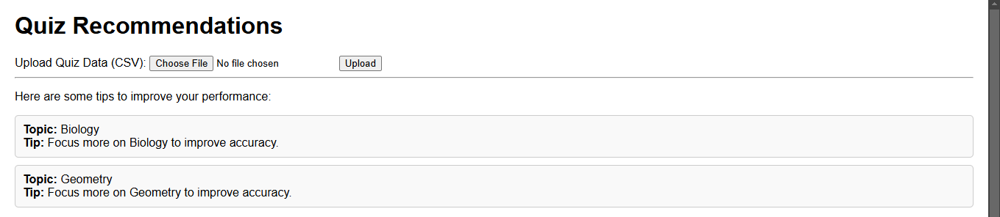
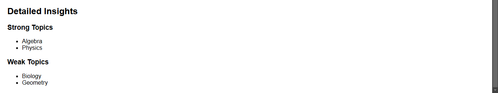
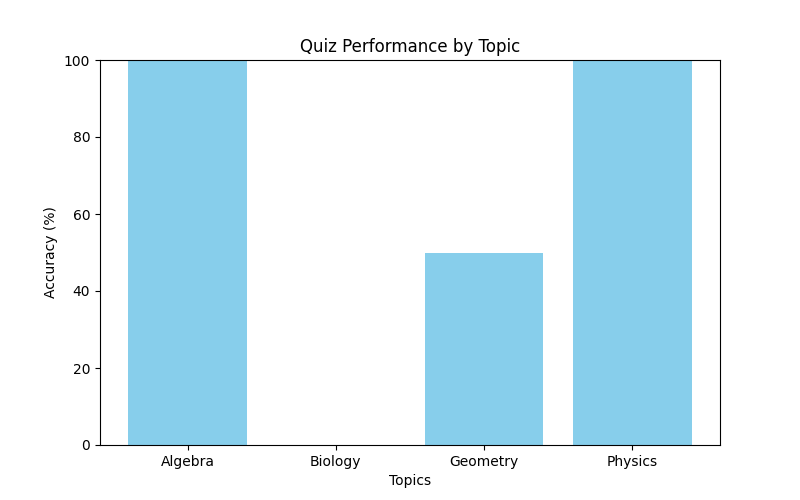


# Personalized Student Recommendations

## Introduction
This project analyzes quiz data to provide students with personalized recommendations for improving their preparation. It identifies strong and weak topics, generates improvement tips, and visualizes performance trends.

## Setup Instructions

Follow these steps to set up and run the project:

1. Clone this repository:
   ```bash
   git clone <https://github.com/cmwaseemyousef/quiz_recommendations_project.git>
   cd quiz_recommendations_project

## Screenshots

- **File Upload Section**:
  

- **Recommendations and Insights**:
  

- **Performance Chart**:
  
